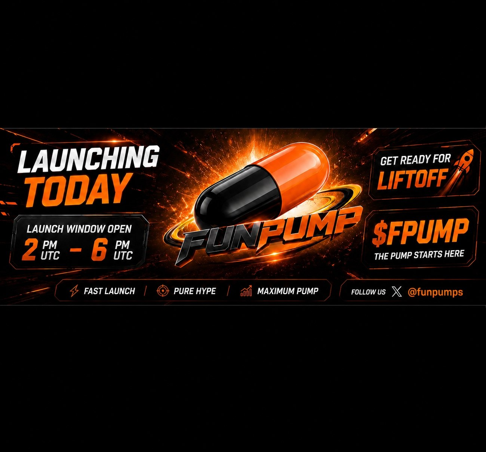

# 💊 FunPump Token Launchpad

<figure><figcaption></figcaption></figure>

## 🚨 **FUNPUMP TOKEN LAUNCHPAD!**&#xD83D;�

Introducing FunPump – the ultimate Solana token launchpad! Launch viral tokens, trade smart, and build communities. Plus, $FPUMP token to fuel it all!

Upgrades Coming Very soon!!

1. social media features to turn FunPump into the real Crypto Twitter!!
2. we are going to pay to teach people proper TA and buy them 5er's prop firm trading accounts, small account while you learn, then we will buy you $500 usd 2-step $100k usd tradinf account.
3. We are going to build a free dex screener, funded by FunPump profits and create dividends for holding our token. if you hold you get a % of profits we make.

Key Features: No trading bots, no same name token/ symbols on FunPump!💹 Token Reviews; Star ratings, comments, likes/dislikes – community-driven vibes! ⭐️ Creator Profiles:Verified badges, KYC Optional, reputation scores, stats tracking 📊 Follow System: Connect with top creators & traders 👥

* Profits fuel grants, giveaways & legit project funding and support! 🎉

Join the hype:

* Docs: hopiumswapinfo.gitbook.io/FunPump
* X: x.com/funpumps
* TG: t.me/FunPumpOfficia…
* Discord: discord.gg/zAdamfaB53

* Fair & Fast Meme Launches – No more slow, complicated token launches.
* Auto Liquidity & LP Locking – Protecting investors from rug pulls.
* Community-Driven Hype – Powered by the most active meme degens.&#x20;
* Rewarding Creators with incentives - We are adding a few options for setting the market cap for Raydium: $40k - 2 Sol, $60k - 3 Sol, and $80k - 4 Sol. This would mean the higher the market cap, the higher the reward for hitting Raydium.

## Upgrades After Launch

* Adding live streams for token creators to add a little crazy back into the trenches.
* Platform chat where everyone can chat while trading meme coins.
* Staking for our project token $FPUMP
* Create revenue sharing that will help fund new legit project launches, airdrops, rewards for token creators, giveaways, and contests
* Feature like Twitter Spaces.
* Upgrades to the FunPump UI to make the website look great and easier to use.&#x20;

## Official Project Links

[Twitter](https://x.com/funpumps)

[Telegram](https://t.me/FunPumpOfficialSol)

[Discord](https://discord.gg/zAdamfaB53)

