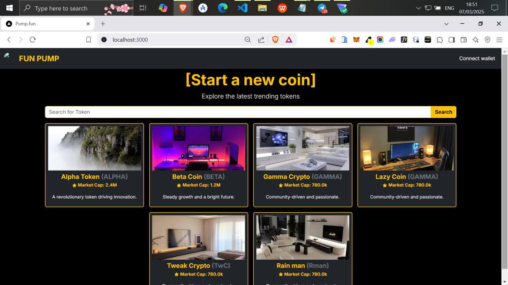

# 💊 FunPump Project Info

<figure><figcaption></figcaption></figure>

## Introducing FunPump

The Ultimate Solana Memes Launchpad! The [#Solana](https://x.com/hashtag/Solana?src=hashtag_click) meme season is heating up, and FunPump is here to fuel the next wave of viral meme coins! We are creating the best token launchpad on Solana.&#x20;

What makes FunPump different?

* Fair & Fast Meme Launches – No more slow, complicated token launches.
* Auto Liquidity & LP Locking – Protecting investors from rug pulls.
* Community-Driven Hype – Powered by the most active meme degens.&#x20;
* Rewarding Creators with incentives - We are adding a few options for setting the market cap for Raydium: $40k - 2 Sol, $60k - 3 Sol, and $80k - 4 Sol. This would mean the higher the market cap, the higher the reward for hitting Raydium.

## Upgrades After Launch

* Adding live streams for token creators to add a little crazy back into the trenches.
* Platform chat where everyone can chat while trading meme coins.
* Staking for our project token $FPUMP
* Create revenue sharing that will help fund new legit project launches, airdrops, rewards for token creators, giveaways, and contests

## Official Project Links

[Twitter](https://x.com/HopiumSwap)

[Telegram](https://t.me/FunPumpOfficialSol)

[Discord](https://discord.gg/zAdamfaB53)

