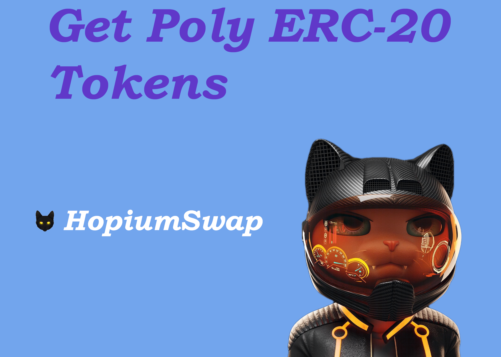

# Get Poly ERC-20 Tokens

The native tokens of Polygon Network are Poly ERC-20.

To do most things on Polygon Network, you will need to pay gas, which comes in the form of Poly ERC-20.

You will also need the Poly ERC-20 version of any token you want to trade, stake etc. on Polygon Network.

You can go a few ways about converting your tokens to Poly ERC-20, but here are the ones we recommend:



[**SafePal** ](https://safepal.io/download)- You don't need an account, or to register etc. Execute cross-chain swaps directly from your wallet.

📖 [Here's a quick guide they made to help you out.](https://docs.safepal.io/safepal-app/cross-chain-swap-tutorial)


