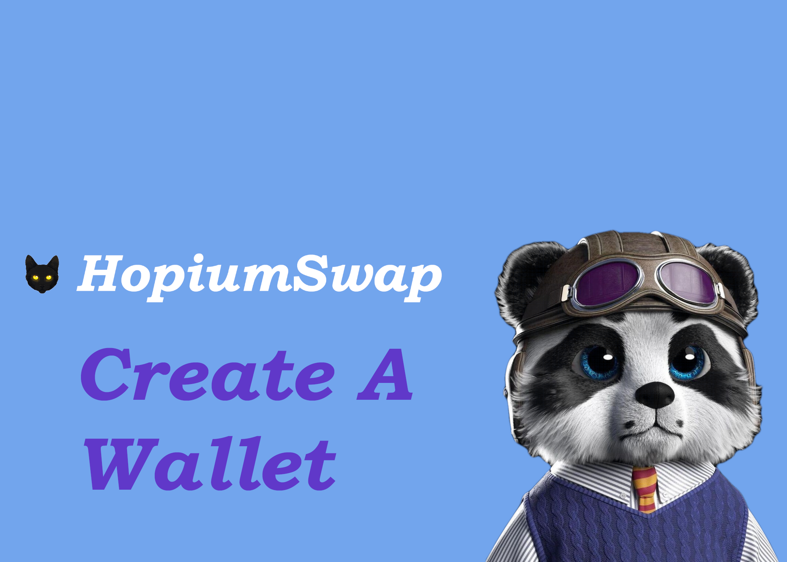

# Create a Wallet

To get started on HopiumSwap, the first thing you'll need is to set up a wallet that supports Polygon Network. Wallets are available both on desktop computers and on smartphone devices. You'll need to choose the wallet that fits your needs best.


**When you're setting up a wallet, be sure to:**

* ✅ **Download and install only the latest version from an official source.**
* ✅ **Follow the setup guide carefully.**
* ✅ **Safely back up your recovery phrases.**
* ❌ **NEVER share your recovery phrases with anyone, under any circumstances.**
* ❌ **NEVER input your recovery phrase to a website or app, other than your wallet app.**


## Smartphone/Mobile or Desktop wallet?

Mobile device wallets and desktop-based wallets have different strengths and weaknesses. Consider which fits your needs better to help decide which type of wallet to use.

|                                   | Mobile | Desktop |
| --------------------------------- | ------ | ------- |
| Use anywhere                      | ✅      | ➖       |
| Easy to use                       | ✅      | ➖       |
| More secure                       | ➖      | ✅       |
| Accessibility friendly            | ➖      | ✅       |
| Damage/loss/theft resistant       | ➖      | ✅       |
| Power/connection outage resistant | ✅      | ➖       |

## **Smartphone/Mobile wallets**

Smartphone/Mobile wallets allow you to access your crypto almost anywhere. Wallets are available on both Android and iOS devices.

### Which mobile wallet should I choose?

This comparison table gives an overview of the most popular mobile wallets used with HopiumSwap.

|                                                                  | Token Pocket | MetaMask | Coinbase Wallet | Trust Wallet                  | SafePal |
| ---------------------------------------------------------------- | ------------ | -------- | --------------- | ----------------------------- | ------- |
| Polygon Network support                                          | ✅            | ⚠️       | ✅               | ✅                             | ✅       |
| Built-in DApp browser                                            | ✅            | ➖        | ✅               | 
✅ Android

⚠️ iOS
 | ✅       |
| Hardware wallet compatible                                       | ➖            | ✅        | ✅               | ➖                             | 🔶      |
| Open source (auditability)                                       | ✅            | ✅        | ✅               | ✅                             | ➖       |
| 
Interact with Polygon Network

(for advanced users!)
 | ➖            | ✅        | ➖               | ➖                             | ➖       |

⚠️ Requires some setup\
🔶 Only supports SafePal hardware wallet

You can find more in-depth information about each wallet below, as well as download links and installation guides.



 (3) (4) (5) (1) (1) (1) (1) (1) (1) (1).png>)

MetaMask is a very popular browser-based wallet plugin that supports ERC20 (Ethereum network) and Poly ERC-20 tokens.

​**Pros:**

* Open source for auditability
* WEB3 capable on Polygon ScanScan
* A strong history of security and reliability
* A large amount of how-to guides and resources online
* Many tools and custom settings
* Offers ETH purchases with Transak
* Supports a very large number of languages
* Is also available a browser plugin for desktop devices

**Cons:**

* Longer setup time than other options
* Additional steps needed to use with Poylgon Network and HopiumSwap
* Extra information and settings may confuse beginners

[**Download MetaMask**](https://metamask.io/download.html) (Automatically detects device)\
[**MetaMask Setup Guide**](https://academy.binance.com/en/articles/connecting-metamask-to-binance-smart-chain)



 (1) (1) (1) (1) (1) (1).png>)

Millions of users choose Coinbase Wallet to earn yield with DeFi, swap more than 5,500 assets, and hold their NFT collections. Coinbase wallet supports Poly ERC-20 Tokens and Polygon Network).

**Highlights:**

* Most downloaded mobile dapp wallet in the United States with 12M+ active Wallet users.
* No additional steps needed to use with Polygon Netwrok and HopiumSwap.
* Premier audience: Up to 89M+ Coinbase retail app users to onboard to Coinbase Wallet as they start to explore web3.
* Easy to transfer assets from Coinbase retail app.
* Fiat On-ramp: Users can now directly purchase crypto with fiat in all 86 countries where Coinbase operates, without leaving Wallet.
* Industry leading security with secure cloud backup.

[**Download Coinbase Wallet**](https://coinbase-wallet.onelink.me/q5Sx/fdb9b250) **(Automatically detects device)**

[**Coinbase Wallet Setup Guide**](https://www.coinbase.com/wallet/getting-started-mobile)

\_\_

_Coinbase Wallet is a self-custody wallet providing software services subject to Coinbase Wallet_ [_Terms of Service_](https://wallet.coinbase.com/terms-of-service) _and_ [_Privacy Policy_](https://wallet.coinbase.com/privacy-policy)_. Coinbase Wallet is_ [_distinct_](https://help.coinbase.com/en/wallet/getting-started/what-s-the-difference-between-coinbase-com-and-wallet) _from Coinbase.com, and private keys for Coinbase Wallet are stored directly by the user and not by Coinbase. Fees may apply. You do not need a Coinbase.com account to use Coinbase Wallet._



 (3) (4) (1) (1) (1) (1) (1) (1) (1) (3).png>)

Token Pocket is a cryptocurrency management app that natively supports many cryptocurrency networks. It also has a desktop application available.

​**Pros:**

* Open source for auditability
* Allows users to easily switch between many crypto networks
* Supports many networks by default
* A less cramped user experience than browser plugin wallets
* Is also available as desktop software devices

**Cons:**

* Only supports Chinese and English languages
* Has some issues with the English translation
* Has fewer online resources than more established wallets

[**Download Token Pocket App**](https://www.tokenpocket.pro/en/download/app) (Automatically detects device)

**Token Pocket Mobile Setup Guide**

1. Visit the Token Pocket website and tap **Mobile**.

1. Your device will be automatically detected. Tap the **Google Play** or **App Store** button and install the Token Pocket app.
2. Once Token Pocket is installed, open it. You’ll be met by a screen asking whether you have an existing wallet or would like to create a new one. Tap **No accounts, Create Now**.

If you do have an existing wallet to import, use the top option instead.

1. On the next page, find **Polygon Network** in the list and tap it.

1. Next, on the “Create way” page, tap **Create Wallet**.

1. You’ll be asked to enter a password. For your security, make sure your password is judged as “Strong”. You can also add a hint, but make sure it’s something only you will understand. When you’re ready, tap **Create Wallet**.

And that’s it, all done!

**Getting private key from mobile to import to desktop**

Token Pocket lets you use both a desktop and mobile wallet. This section will cover how to get your private key from your mobile wallet to import into your desktop wallet.


Please be extremely careful with how you handle your private keys. Giving your private keys to someone will give them full access to your coins! Token Pocket is an open source project and will use your private key to import your wallet. Even so, only use your private key with applications you trust and can verify are legitimate!


1. Tap the **Me** tab on the bottom ribbon and tap **Manage Wallets**.

1. On the next page, tap the Polygon Network entry. Be careful not to tap the address part, or you’ll only copy that to clipboard instead.

1. When the menu appears, find and tap the **Export Private Key** option. Type in your password to get your private key.


\*\*NEVER, in any situation, should you ever give someone your private key or recovery phrase ("seed phrase"). This will give someone complete access to your crypto!

The genuine HopiumSwap site and staff will never ask you to input your seed phrase.\*\*


Now you have your private key ready to import your wallet into the desktop version of Token Pocket.



 (1).png>)

SafePal is available as both a software and hardware wallet. The wallet is easy to install and create, and comes ready to support Poly ERC-20 tokens and Polygon Network right away.

**Pros:**

* Easily switch between several crypto networks
* Has the option for Google Authenticator built in
* Supports a large number of languages
* Setup process is very simple
* Is available as both a software and hardware wallet (work together)

**Cons:**

* Isn't fully open source
* Has some features that are not yet ready for use (such as DeFi)
* Does not give user notifications
* Does not enforce strong security during initial setup and wallet creation
* Has fewer online resources than more established wallets

​[**Download SafePal**](https://safepal.io/download) (Automatically detects device)\
[**SafePal Setup Guide**](https://blog.safepal.io/binance-smart-chain-x-safepal/)



## **Desktop/Web Browser wallets**

Desktop wallets are available on your home computer or laptop computer. Wallets on your computer can run as standalone applications, or as web browser plugins for popular browsers like Chrome and Firefox.

### Which desktop wallet should I choose?

This comparison table gives an overview of the most popular desktop wallets used with HopiumSwap.

|                                                              | MetaMask | Binance Wallet | Coinbase Wallet | Token Pocket |
| ------------------------------------------------------------ | -------- | -------------- | --------------- | ------------ |
| Polygon Network support                                      | ⚠️       | ✅              | ✅               | ⚠️           |
| Built-in DApp browser                                        | ➖        | ➖              | ➖               | ✅            |
| Hardware wallet compatible                                   | ✅        | ✅              | ✅               | ➖            |
| Open source (auditability)                                   | ✅        | ✅              | ✅               | ✅            |
| 
Interact with PolygonScan

(for advanced users!)
 | ✅        | ➖              | ➖               | ➖            |

⚠️ Requires additional setup

You can find more in-depth information about each wallet below, as well as download links and installation guides.



 (3) (4) (5) (1) (1) (1) (1) (1) (1) (1) (4).png>)

MetaMask is a very popular browser-based wallet plugin that supports ERC20 (Ethereum network) by default, and Poly ERC-20 with a little work.

​**Pros:**

* Open source for auditability
* WEB3 capable on PolygonScan
* A strong history of security and reliability
* A large amount of how-to guides and resources online
* Many tools and custom settings
* Supports a very large number of languages
* Is also available on mobile devices

**Cons:**

* Longer setup time than other options
* Additional steps needed to use with Polygon Network and HopiumSwap
* Extra information and settings may confuse beginners

[**Download MetaMask**](https://metamask.io/download.html) (Automatically detects browser)\
[**MetaMask Setup Guide**](https://academy.binance.com/en/articles/connecting-metamask-to-binance-smart-chain)




NEVER, in any situation, should you ever give someone your private key or recovery phrase ("seed phrase"). This will give someone complete access to your crypto!

The genuine HopiumSwap site and staff will never ask you to input your seed phrase.

