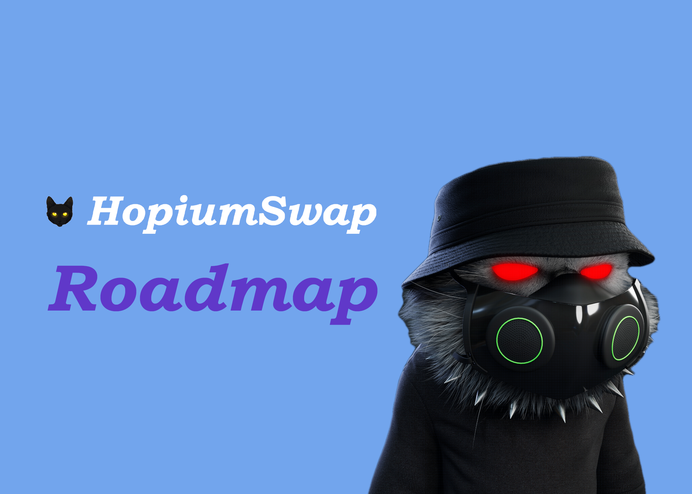

# 🧐 HopiumSwap Roadmap

_Updated On Nov 10, 2024_

### Finally, The HopimSwap Roadmap.

The brand new up-and-coming Polygon Network swap exchange!

Hopium is a way of crypto life.

The HopiumSwap concept was founded by a person known as "Crypto Monster" in March 2022. It is different because HopiumSwap is built on Polygon Network (MATIC), which offers faster and cheaper transactions compared to Ethereum or Binance Smart Chain.

.webp>)

**PHASE 1**

* Website Launch
* Token Launch
* HopiumSwap Exchange Launch
* Advertising Campaigns&#x20;
* 4,000 Telegram Members
* 1,000+ Holders&#x20;
* $1 Million+ Market Cap&#x20;
* NFT Marketplace

**ROADMAP PHASE ONE**&#x20;

In phase one, we will be launching Hopiumswap along with our exchange token "Hopium Token" first. Once we have the exchange launched the NFT collection will continue and get finished. Building the community is key for the success of HopiumSwap and all other projects we will be launching. HopoiumSwap is only a part of what we are building and plans to launch. Keep checking in for more updates as we post them!&#x20;

**COMMUNITY BUILDING**&#x20;

We as a team understand the importance and power of having a good community. We do not and will never take the community’s influence lightly. Our community discord server is open to everyone and we have started accepting whitelist requests for our collection from other community projects and Daos. We’ll also be rewarding well-deserved community members in our discord as well.

**MARKET CAP WEBSITE**&#x20;

We are creating our very own market cap website where you can track live prices of coins and tokens, compare prices of different exchanges, and get top-notch crypto news, etc ADVANCED AI TOOLS We are creating a free-to-use AI website with access to various AI features such as;

* Support for open AI DALL-E-2 to gebnerate AI images
* Support for stable diffusion to generate AI images
* Support for generating text in 37 languages
* Unlimited custom template creation feature
* Unlimited custom AI chatbot creation feature
* AI speech-to-text speech feature
* AI text-to-speech feature with 540 voices and 140 languages
* AI chat assistants feature with 42 different bots, etc EXCHANGE TESTING As part of our endeavor to provide value and make an impact on the Polygon network. We’re building the best Decentralized exchange(HOPIUMSWAP) yet to be seen on Polygon. In our bid to make it the best, we’ll be releasing our dex for public testing and take the community’s feedback for further improvement before mainnet release. Like Philip Stanhope said in 1774; “Whatever is worth doing at all, is worth doing well.”&#x20;

&#x20;  **PUBLIC MINT PHASE ONE**&#x20;

* At this stage, only 4,000 out of the 10,000 HopiumCatz collections will be open to the public for minting at a date, time and price to be announced soon. Part of the funds generated from the mint will be directed towards providing liquidity for the HopiumSwap exchange mainnet

&#x20;**HOLDERS DAO**

&#x20;After minting, HopiumCatz holders will immediately be able to verify their          NFTs and gain access to private channels where they’ll be able to connect with   other holders and enjoy other benefits such as;

* &#x20;⁃ Voting rights
* &#x20;⁃ Crypto calls and free trading class
* &#x20;⁃ NFT alpha calls ⁃ Giveaways
* &#x20;⁃ Whitelist for other projects
* &#x20;⁃ Raffles, e.t.c.
* &#x20;\- % Of Exchange Profits For Holders&#x20;

&#x20;**NFT STAKING**&#x20;

* Our NFT staking platform will be released after the first stage mint, now you can relax and let your NFTs work for you. Holders can now stake their NFTs to earn $Hope tokens and have access to other passive income benefits such as;
* ⁃ HopiumSwap exchange revenue profits sharing&#x20;
* ⁃ Airdrops
* &#x20;⁃ And many other benefits to be released in chapter two of our project.

**Phase 2**

* CoinGecko Listing&#x20;
* CoinMarketCap Listing&#x20;
* $5 Million+ Market Cap
* 2,500+ Holders
* 10,000 Telegram Members
* Hire a team full-time to take down crypto scammers (like bitboy) etc...

**Phase 3**

* &#x20;$25Million+ Market Cap
* 10,000+ Holders
* 25,000 Telegram Members
* Largest Swap Exchange On Polygon&#x20;
* use a portion of our profits to send Starlink to Nigeria and other countries, and send food and other supplies as well.&#x20;
* Help food banks, build drug addiction centers, and housing for addicts to get clean.&#x20;

## Coming Soon!!

* Launching with the main swap functions of HopiumSwap
* Added functions and contracts gradually once launched
* Build a larger HopiumSwap team&#x20;
* HopiumSwap will have customer support 7 days a week unlike other swap exchanges, we believe in creating a strong community where there is "REAL" support and help when users need it!

