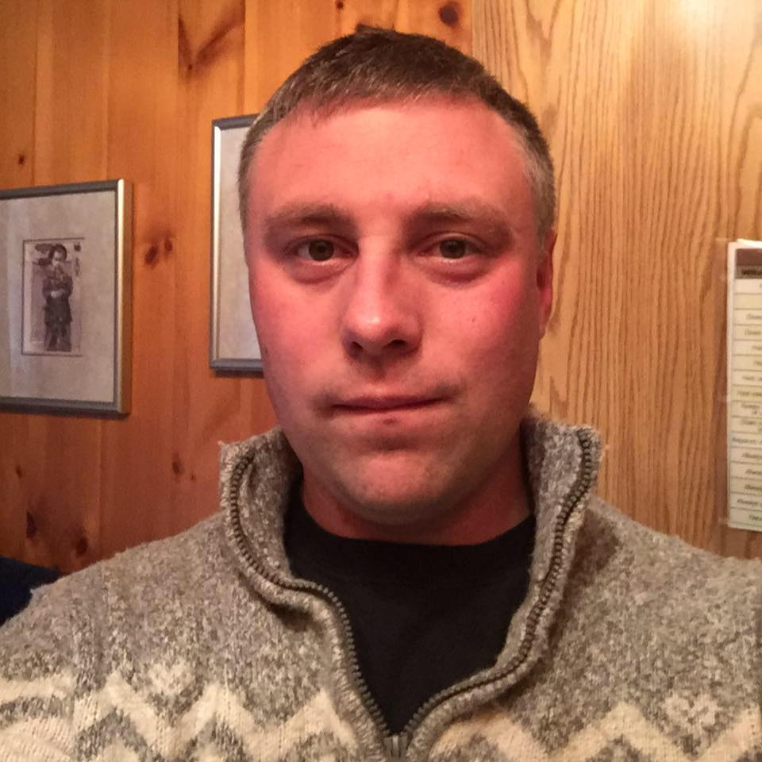

# 😎 Team Members

## HopiumSwap Founder And CEO

<figure><figcaption>
<strong>Matthew Bicknell, From British Columbia, Canada</strong>
</figcaption></figure>

My name is matthew bicknell, i have been in crypto for 9 years and trade/teach people as well. I am a dev, build websites and have other projects on the go besides HopiumSwap exchange. Feel free to message me on my social links before if you have any questions or just want to say hi! (s0cialhub is my free speech social media platform).

**Social Links**

**Twitter -** [**https://twitter.com/HopiumSwapCEO**](https://twitter.com/HopiumSwapCEO)

**s0cialhub -** [**https://www.s0cialhub.com/admin**](https://www.s0cialhub.com/admin)

**Facebook -** [**https://www.facebook.com/HopiumSwapFounder**](https://www.facebook.com/HopiumSwapFounder)

**Telegram -** [**https://t.me/CryptoMonsterOfficial**](https://t.me/CryptoMonsterOfficial)

## Lead Developer And Co-Founder

<figure><figcaption></figcaption></figure>

Info Soon the be added about our lead team developer and co founder of HopiumSwap exchange.&#x20;

## Project Manager&#x20;

<figure><figcaption></figcaption></figure>

Info Soon the be added about our poject manager of HopiumSwap exchange.
